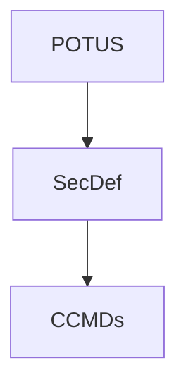

# The United States Armed Forces

The U.S. Armed Forces, founded **14 June 1775**, act as the military force of the United States of America. Composed of *six service branches*, and *6 of the 8* services that make up the **Uniformed Services of the United States**^[other 2 servies are the U.S. Public Health Service Commissioned Corps & the NOAA Commissioned Officer Corps]

## Command

**Presidential** command over the Armed Forces is established in *Article II* in the Constitution, naming the president **Commander in Chief** of the Army & Navy of the United States & of the **Militia** of the States, when called into the actual Service of the United States.

The U.S Armed Forces are split between **two** cabinet departments.  
		1. The **Department of Defense** serving as the primary cabinet department for military affairs.  
		2. **Department of Homeland Security** responsible for administering the U.S. Coast Guard

#### Chain of Command

**Military operational chain of command flow**

## The Branches

The 6 service branches of the Armed Forces:
- Army (**USA**)
	- *14 June 1775*
- Marine Corps (**USMC**)
	- *11 July 1798*
- Navy (**USN**)
	- *27 March 1794*
- Air Force (**USAF**)
	- *18 September 1947*
- Space Force (**USSF**)
	- *20 December 2019*
- Coast Guard (**USCG**)
	- *28 January 1915*^[1915 was creation of the Coast Guard, prior service was the **Revenue-Marine** founded *4 August 1790*]

- - - 

Each military service is assigned a specific role & domain of operations. With the **Army** conducting *land operations*, **Navy** & **Marine Corps** specializing in amphibious & maritime littoral operations, **Air Force** conducting *air operations*, **Space Force** conducting *space operations*, & the **Coast Guard** who uniquely specializes in *maritime operations* & also as a *law enforcement* agency.

Five of the branches are organized under the Department of Defense's military departments:  
	1. Army  
	2. Marine Corps  
	3. Navy  
	4. Air Force  
	5. Space Force

The Coast Guard is nominally under the **Department of Homeland Security** but may be transferred to the DoD's Department of the Navy at the direction of the President or Congress.  
Also, with the exception of the Coast Guard, the services only *organize*, *train*, & *equip* forces. The **Combatant Commands** are responsible for operational control of non-service retained forces.

### Army, USA

> Largest & oldest service of the Armed Forces.  
> Established in **1775** as the *Continental Army*, it consists of one million soldiers across the Regular Army, Reserve Army, & Army National Guard

> [!note] Army Basic Organization  
> The **Army** is organized under the **Department of the Army**, a military department under the leadership of the *secretary of the Army* & *under secretary of the Army* 
> 
> > The Army itself is led by the *chief of staff of the Army* & *vice chief of staff of the Army* both generals advised by the *sergeant major of the Army*

Primary responsibility is conducting of prompt & sustained land combat as part of the joint force. Army landpower focuses on destroying an enemy's armed forces, occupying its territory, & breaking the will of an adversary.

**5 Core Competencies of the Army**:
1. Prompt & Sustained land combat
2. Combined arms operations
	1. Combined arms maneuver & wide area security
	2. Armored & mechanized operations
	3. Airborne & air assault operations
3. Special Operations
4. Set & Sustain the theater for the joint force
5. Integrate national, multinational, & joint power on land
 

#### Army Commands

> Overall, U.S. Army is organized into **four** major Army Commands, **nine** Army Service Component Commands^[Army Component Commands serve as the Army component & joint force land component commanders for the CCMDs], & **thirteen** Direct Reporting Units (DRU)

| Name                                | Acronym     | Mission                                                                                                                                                    | Headquarters         |
| ----------------------------------- | ----------- | ---------------------------------------------------------------------------------------------------------------------------------------------------------- | -------------------- |
| Headquarters Department of the Army | **HQDA**    | Army service headquarters led by the chief of staff of the Army                                                                                            | The Pentagon, VA     |
| Army Forces Command                 | **FORSCOM** | Provides Army land forces to CCMDs                                                                                                                         | Fort Liberty, NC     |
| Army Materiel Command               | **AMC**     | Provides technology, acquisition support, & logistics for Army land forces                                                                                 | Redstone Arsenal, AL |
| Army Training and Doctrine Command  | **TRADOC**  | Recruits, trains, & educates Army soldiers & develops Army doctrine                                                                                        | Fort Eustis, VA      |
| Army Futures Command                | **AFC**     | Leads Army modernization efforts, including developing future force requirements, designing future force organizations, & delivering materiel capabilities | Austin, TX           |
| Army Reserve                        | **USAR**    | Oversees & maintains Army reserve forces                                                                                                                   | Fort Liberty, NC     |
| Army National Guard                 | **ARNG**    | Army component of the National Guard                                                                                                                       | The Pentagon, VA     |

### Marine Corps, USMC

> Established in 1775 as the **Continental Marines**, The USMC serves as the Armed Forces' *naval land force*, responsible for executing *amphibious warfare* & operating in the maritime littorals^[The part of a river, lake, or ocean close to the land, *Littoral* zone covers the region between high & low tide] in support of the U.S. Navy

> [!info] USMC Organization  
> Organized under the **Department of the Navy**, the Marine Corps itself is led by the **Commandant of the Marine Corps** & the **Assistant Commandant of the Marine Corps**. Both generals advised by the **Sergeant Major of the Marine Corps**
> 
> > Dept of Navy is a military department under the leadership of the secretary of the Navy & Under Secretary of the Navy. *Both civilian appointed leaders*.

#### USMC Mission

Marine Corps statutory mission is outlined in **10 U.S.C. § 5063** as originally introduced under the *National Security Act of 1947*

**3 primary areas of responsibility:**
1. Seizure or defense of advanced naval bases & other land operations to support naval campaigns
2. Development of tactics, techniques, & equipment used by amphibious landing forces in coordination with the Army & Air Force
3. Such other duties as the President or Department of Defense may direct

#### Marine Corps Commands

Under Headquarters Marine Corps, the USMC is organized into the *Fleet Marine Force*, multiple commands, & Marine Corps service components to the *unified combatant commands*

| Command                                                        | Acronym                     | Mission                                                                                                                                                                                                                            | Headquarters                                  |
| -------------------------------------------------------------- | --------------------------- | ---------------------------------------------------------------------------------------------------------------------------------------------------------------------------------------------------------------------------------- | --------------------------------------------- |
| Headquarters Marine Corps                                      | **HQMC**                    | Marine Corps service headquarters led by the Commandant of the Marine Corps                                                                                                                                                        | The Pentagon, VA                              |
| Fleet Marine Force Atlantic / U.S. Marine Corps Forces Command | **FMFLANT** / **MARFORCOM** | Provides Marine Corps forces in support of the Navy's US Fleet Forces Command. Also serves as the USMC Forces Command, commanding Marine Corps retained service forces & providing forces for joint, naval, & service requirements | Naval Support Activity Hampton Roads, VA      |
| Fleet Marine Force, Pacific                                    | **FMFPAC**                  | Provides Marine Corp forces in support of the U.S. Navy's United States Pacific Fleet                                                                                                                                              | Camp H.M. Smith, HI                           |
| Marine Corps Systems Command                                   | **MARCORSYSCOM**            | Acquisition command for all Marine Corps ground & information technology programs                                                                                                                                                  | Marine Corps Base Quantico, VA                |
| U.S. Marine Corps Forces Reserve                               | **MARFORRES**               | Oversees & maintains the U.S. Marine Corps reserve forces                                                                                                                                                                          | Marine Corps Support Facility New Orleans, LA |

### Navy, USN

> The maritime force originally established in **1775** as the *Continental Navy*, the Navy is the principal maritime warfare operations service of the Armed Forces'. Consists of the Regular Navy & Navy Reserves

> [!info] Navy Organization  
> Navy is organized under the **Department of the Navy**, the military dept. under leadership of the **Secretary of the Navy** & **Under Secretary of the Navy**. The Navy itself is led by the **Chief of Naval Operations, CNO** & **Vice Chief of Naval Operations, VCNO**. Two admirals advised by the **Master Chief Petty Officer of the Navy**

**Five Enduring Functions of the Navy:**
1. Sea Control
2. Power Projection
3. Deterrence
4. Maritime Security
5. Sealift

#### Naval Commands

Navy is organized into **8** navy component commands^[8 naval component commands command operational forces & serve as joint force maritime component commands] 

## Combat Support Agenices

> [!learn] Combat Support Agency (**CSA**)  
> DoD agencies with combat support missions that service operating forces planning or conducting military operations. Mission is focused on providing support to the echelons at the **CCMD** level & below & may not encompass the full scope of the CSA's mission.
> 
> > Support includes during conflict or in the conduct of other military activities related to countering threats to U.S. national securtiy

| CSA                                                  | Acronym     | Mission                                                                                                                                                                                                           | Headquarters                                 |
| ---------------------------------------------------- | ----------- | ----------------------------------------------------------------------------------------------------------------------------------------------------------------------------------------------------------------- | -------------------------------------------- |
| Defense Contract Management Agency                   | **DCMA**    | Provide administration services for the DoD                                                                                                                                                                       | Fort Gregg-Adams, VA                         |
| Defense Health Agency                                | **DHA**     | Provide & augment medical capabilities for combatant commands                                                                                                                                                     | Falls Church, VA                             |
| Defense Information Systems Agency                   | **DISA**    | Provide, operate, & assure command, control, information sharing capabilities                                                                                                                                     | Fort Meade, MD                               |
| Defense Intelligence Agency                          | **DIA**     | Provide military intelligence to warfighters, defense policymakers, & force planners in the DoD & Intelligence Community (**IC**), in support of U.S. military planning & operations & weapon systems acquisition | DIA Headquarters, JB Anacostia-Bolling, D.C. |
| Defense Logistics Agency                             | **DLA**     | Manages the end-to-end global defense supply chain                                                                                                                                                                | Fort Belvoir, VA                             |
| Defense Threat Reduction Agency                      | **DTRA**    | Identify, develop, & field solutions to counter weapons of mass destruction & emerging threats                                                                                                                    | Fort Belvoir, VA                             |
| National Geospatial-Intelligence Agency              | **NGA**     | Delivers geospatial intelligence to policymakers, military service members, intelligence professionals, & first responders                                                                                        | Fort Belvoir, VA                             |
| National Security Agency  / Central Security Service | **NSA/CSS** | Provides timely & accurate cryptologic support, knowledge, & assistance to the military cryptologic community. Provide actionable signals intelligence & cybersecurity support to the Armed Forcces               | Fort Meade, MD                               |
